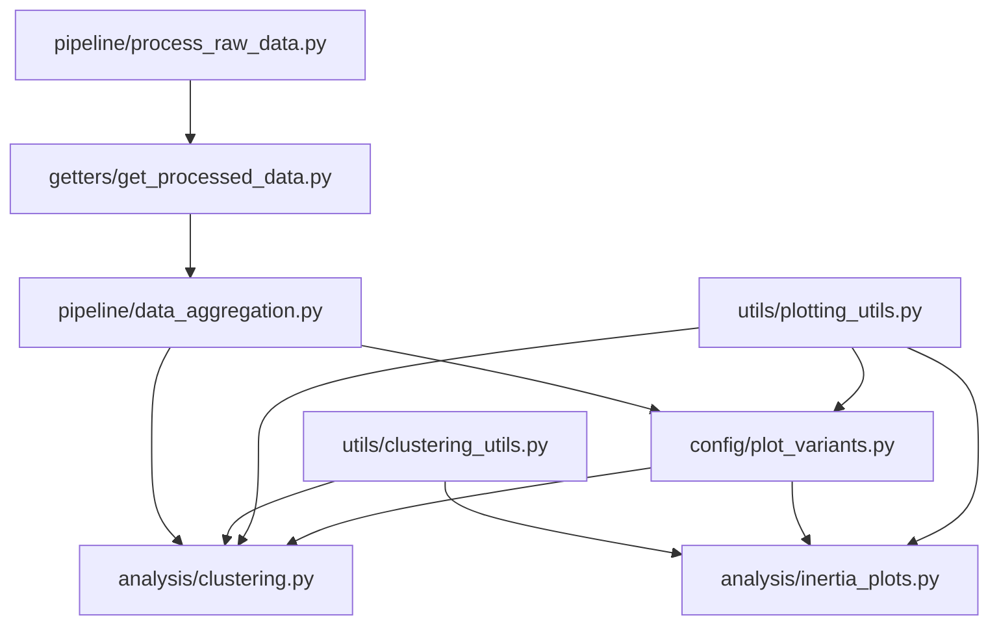

# asf_smart_meter_exploration

## Summary

This repo holds scripts for exploring the [Low Carbon London smart meter dataset](https://www.kaggle.com/datasets/jeanmidev/smart-meters-in-london) with the aim of generating ideas for ASF projects involving smart meter data.

The first exploration relates to <b>clustering of households according to their electricity usage patterns</b>. For example, for each household we can find the mean amount of electricity used in each half-hour of the day and apply k-means clustering to this set of time series to find "archetype" daily usage patterns. We can then see how many households fall into each cluster and identify the distributions of particular household characteristics within each cluster. (The Low Carbon London data only contains information on the households' tariffs and Acorn groups.) We can also process the data to find quantities such as (for each half hour) the average difference between electricity used in winter vs summer, or weekdays vs weekends, and cluster these instead to find different groupings.

The functions to cluster and produce plots for several different variants are found in `asf_smart_meter_exploration/analysis/clustering.py`. Within this file there is a dictionary of variants and for each variant plots are produced showing the following (the relevant filename suffixes are shown in brackets):

- the usage curves for each household, along with the means for each cluster (`_observations`)
- the numbers of households in each cluster (`_counts`)
- the distribution of tariffs in each cluster (`_tariff`)
- the distribution of Acorn groups in each cluster (`_acorn`)

As k-means clustering is being applied, we need to determine sensible values for the number of clusters for each variant. This can be performed in `asf_smart_meter_exploration/analysis/inertia_plots.py` by plotting the inertia for several values of k. The values of k appearing in `asf_smart_meter_exploration/analysis/clustering.py` were chosen using the elbow method applied to these plots.

## Setup

- Meet the data science cookiecutter [requirements](http://nestauk.github.io/ds-cookiecutter/quickstart), in brief:
  - Install: `direnv` and `conda`
- Clone the repo: `git clone git@github.com:nestauk/asf_smart_meter_exploration.git`
- Navigate to the repo folder
- Checkout the correct branch if not working on `dev`
- Run `make install` to configure the development environment:
  - Setup the conda environment
  - Configure `pre-commit`
- Run `direnv allow`;
- Activate conda environment: `conda activate asf_smart_meter_exploration`
- Download the data:
  - `make inputs-pull` will pull the zipped data from S3 and put it in `/inputs` (the scripts in `getters` will unzip it automatically)
  - Alternatively, download the data from [Kaggle](https://www.kaggle.com/datasets/jeanmidev/smart-meters-in-london)
- Perform additional setup in order to save plots:
  - Follow the instructions [here](https://github.com/altair-viz/altair_saver/#nodejs) - you may just need to run `conda install -c conda-forge vega-cli vega-lite-cli`

## Skeleton folder structure

```
asf_smart_meter_exploration/
├─ analysis/
│  ├─ clustering.py - performs the clustering and produces plots
│  ├─ inertia_plots.py - produces inertia plots for determining optimal k in k-means clustering
├─ config/
│  ├─ base.yaml - hyperparameters, file paths
│  ├─ plot_variants.py - dictionary of clustering variants to plot
├─ getters/
│  ├─ get_processed_data.py - getters for processed smart meter / household data
│  ├─ process_raw_data.py - functions to process raw data
├─ notebooks/
│  ├─ examples.py - notebook to demonstrate key operations (loading data, producing plots)
├─ pipeline/
│  ├─ data_aggregation.py - functions to process smart meter data into various formats for clustering
├─ utils/
│  ├─ clustering_utils.py - reusable functions for clustering
│  ├─ plotting_utils.py - reusable functions for plotting
inputs/
├─ halfhourly_dataset/ - unzipped folder of raw data (split into subfolders)
├─ halfhourly_dataset.zip - zipped folder of raw data
├─ household_info.csv - contextual household data
outputs/
├─ figures/
│  ├─ clusters/ - plots of distributions within clusters
│  ├─ inertia/ - inertia plots for determining optimal k in k-means clustering
├─ data/
│  ├─ electricity_data.csv - merged and processed smart meter data
```

## Dependency map



## Contributor guidelines

[Technical and working style guidelines](https://github.com/nestauk/ds-cookiecutter/blob/master/GUIDELINES.md)

---

<small><p>Project based on <a target="_blank" href="https://github.com/nestauk/ds-cookiecutter">Nesta's data science project template</a>
(<a href="http://nestauk.github.io/ds-cookiecutter">Read the docs here</a>).
</small>

```

```
